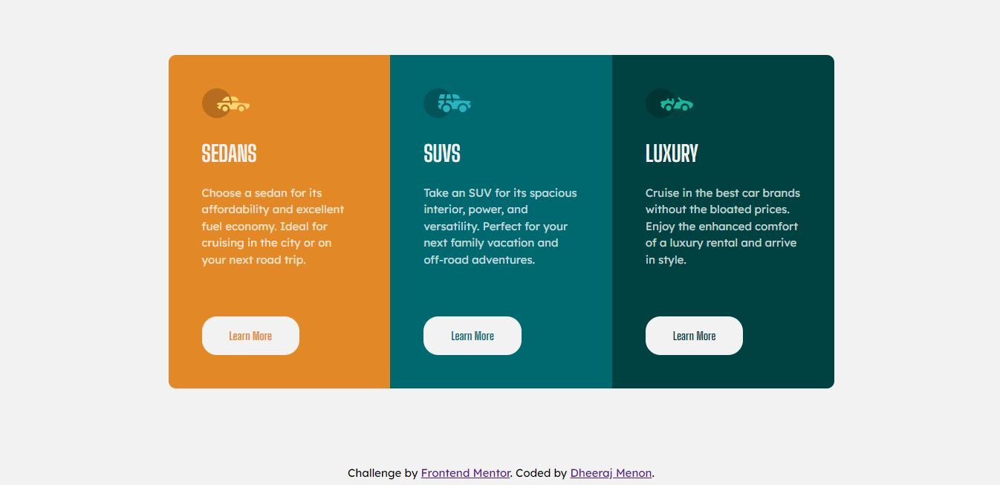

# Frontend Mentor - 3-column preview card component solution

This is a solution to the [3-column preview card component challenge on Frontend Mentor](https://www.frontendmentor.io/challenges/3column-preview-card-component-pH92eAR2-). Frontend Mentor challenges help you improve your coding skills by building realistic projects. 

## Table of contents

- [The challenge](#the-challenge)
- [Screenshot](#screenshot)
- [Links](#links)
- [Built with](#built-with)
- [What I learned](#what-i-learned)
- [Useful resources](#useful-resources)
- [Author](#author)

### The challenge

Users should be able to:

- View the optimal layout depending on their device's screen size
- See hover states for interactive elements

### Screenshot




### Links

- Solution URL: [Solution](https://github.com/dheerajmnk/frontendmentor-challenges/tree/main/3col-preview-card-component)
- Live Site URL: [Live Site](https://dheerajmnk.github.io/frontendmentor-challenges/3col-preview-card-component/index.html)


### Built with

- Semantic HTML5 markup
- CSS custom properties
- Flexbox
- CSS Grid


### What I learned

In order to complete this project, I learnt about Flexbox and Grid from Web Dev Simplified. 

This was the property used to create 3 column grids:

```css
grid-template-columns: 1fr 1fr 1fr;
```

By removing 2 out of 3 fractions in my media query for mobile design, I was able to change my 3 columns into 3 rows:

```css
grid-template-columns: 1fr;
```

### Useful resources

- [Flexbox](https://www.youtube.com/watch?v=fYq5PXgSsbE)
- [Grid](https://www.youtube.com/watch?v=9zBsdzdE4sM)


### Author

- Frontend Mentor - [@yourusername](https://www.frontendmentor.io/profile/dheerajmnk)
- Twitter - [@yourusername](https://www.twitter.com/dheerajmnk)
